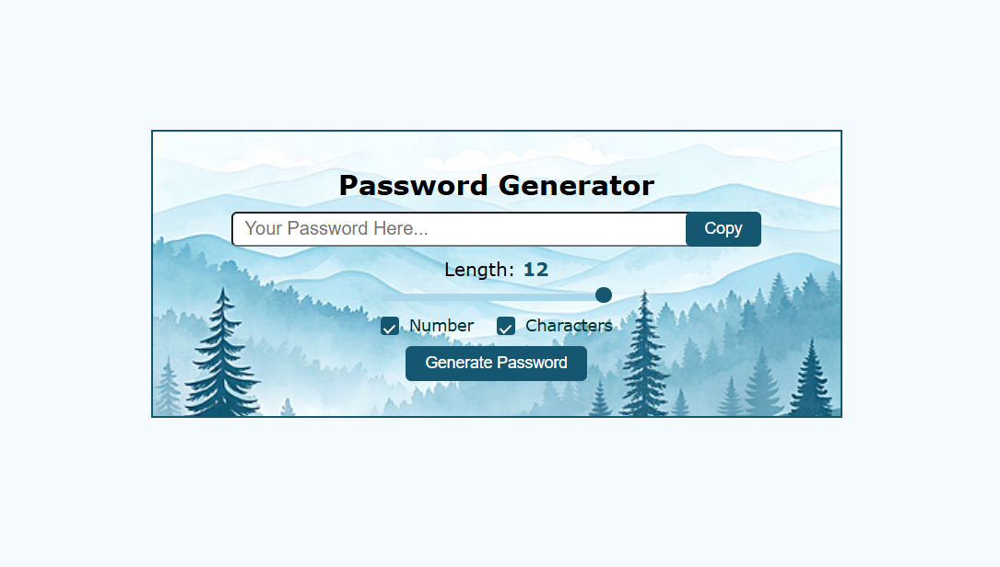

# Password Generator 🔐

A simple and user-friendly web app built with **HTML, CSS, and JavaScript** to generate strong passwords.

## Features
- Generate random passwords of custom length (8–100 characters)  
- Include letters, numbers, and symbols  
- Copy password to clipboard with one click  
- Responsive and clean design  

## How to Use
1. Open `index.html` in your browser.  
2. Adjust the password **length** using the slider.  
3. Select **Numbers** and/or **Characters** options.  
4. Click **Generate Password**.  
5. Click **Copy** to copy the password to your clipboard.  

## Technologies
- HTML  
- CSS  
- JavaScript  

## Screenshot

## License
This project is open-source and free to use.
